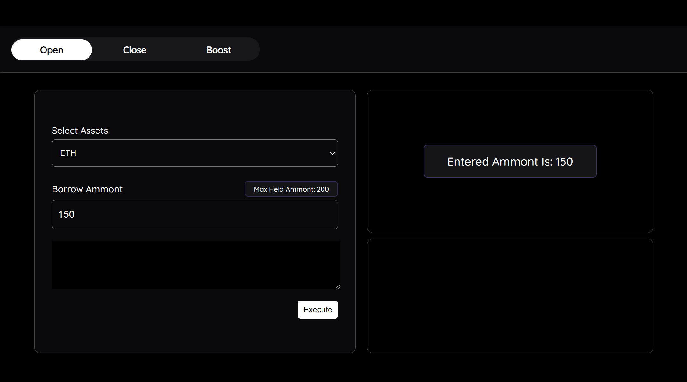

# React web3 App



## Table of Contents

1. [Introduction](#introduction)
2. [Getting Started](#getting-started)
   - [Prerequisites](#prerequisites)
   - [Installation](#installation)
3. [Running the Application](#running-the-application)
4. [Technologies Used](#technologies-used)

## Introduction

This is a React application that involves creating an input field for decimal values greater than zero and displaying the entered value on a label on the right-hand side. However, the value should only be shown after a delay of 1 to 1.5 seconds after the user finishes typing.

## Getting Started

### Prerequisites

Before running the application, ensure you have the following software installed on your computer:

- Node.js: [Download and Install Node.js](https://nodejs.org/)

### Installation

Clone the repository to your local machine:

   ```
   git clone https://github.com/pradipchavda25/web3-react-app.git
   ```

#### Navigate to the project directory:

    cd web3-react-app

#### Install the required dependencies:

    npm install

## Running the Application

#### Start the development server:

    npm start

## Technologies Used

    - React
    - Javascript
    - Html5
    - Css3
